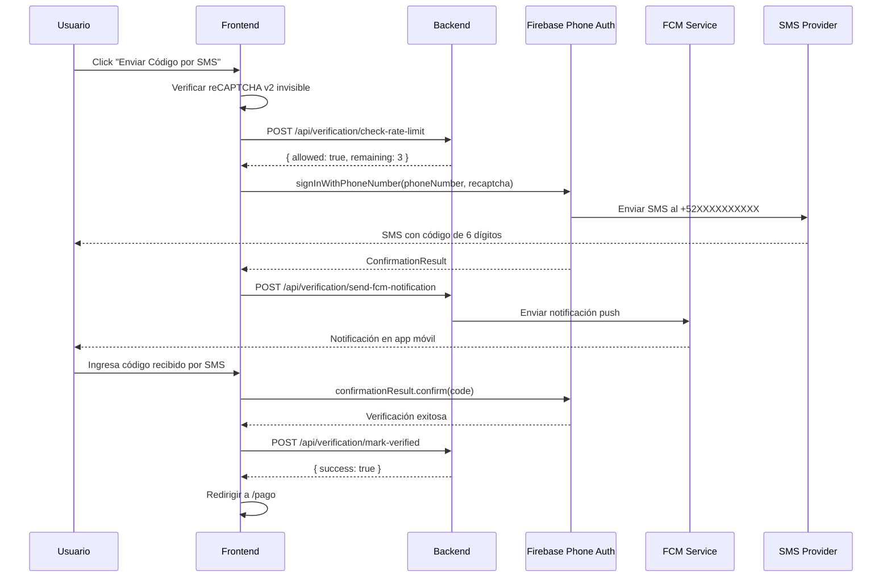

# Firebase Phone Authentication - Implementación Completa

**Fecha**: 2025-11-11
**Versión**: 2.0
**Estado**: ✅ IMPLEMENTADO
**Agentes**: Sentinel + Nexus + Aether

---

## 🎯 Objetivo

Implementar verificación de teléfono **REAL** usando **Firebase Phone Authentication** que envía SMS reales al teléfono del usuario, reemplazando el sistema anterior que solo mostraba códigos en pantalla.

---

## 📊 Comparativa: Sistema Anterior vs Nuevo

| Aspecto | Sistema Anterior | Sistema Nuevo |
|---------|------------------|---------------|
| **Método de verificación** | Código visual en pantalla | SMS real al teléfono |
| **¿Verifica teléfono real?** | ❌ No | ✅ Sí |
| **Servicio** | Código generado internamente | Firebase Phone Auth |
| **Costos** | Gratis | Gratis hasta 10k SMS/mes |
| **Seguridad** | Media | Alta |
| **reCAPTCHA** | No | Sí (v2 invisible) |
| **Rate Limiting** | No | Sí (3 intentos / 6 horas) |
| **FCM Adicional** | Sí | Sí (complemento al SMS) |

---

## 🏗️ Arquitectura de la Solución

### **Flujo Completo**



---

## 🔧 Componentes Implementados

### **1. Frontend: `/src/app/verificar-telefono/page.tsx`**

**Cambios principales:**

- ✅ Importa `RecaptchaVerifier` y `signInWithPhoneNumber` de Firebase Auth
- ✅ Inicializa reCAPTCHA v2 invisible automáticamente
- ✅ Llama a `signInWithPhoneNumber()` para enviar SMS real
- ✅ Guarda `confirmationResult` para verificar después
- ✅ Llama a backend para rate limiting antes de enviar SMS
- ✅ Llama a backend para enviar notificación FCM adicional
- ✅ Verifica código con `confirmationResult.confirm(code)`
- ✅ Llama a backend para marcar como verificado

**Código clave:**

```typescript
// Inicializar reCAPTCHA
window.recaptchaVerifier = new RecaptchaVerifier(auth, 'recaptcha-container', {
  size: 'invisible',
  callback: (response: string) => {
    console.log('reCAPTCHA resolved');
  }
});

// Enviar SMS
const confirmationResult = await signInWithPhoneNumber(auth, phoneNumber, appVerifier);
window.confirmationResult = confirmationResult;

// Verificar código
const result = await window.confirmationResult.confirm(cleanCode);
```

---

### **2. Backend: Nuevos Endpoints**

#### **POST `/api/verification/check-rate-limit`**

**Propósito**: Prevenir abuso limitando intentos de SMS

**Lógica**:
- Máximo 3 intentos por usuario
- Se resetea cada 6 horas
- Almacena intentos en colección `phoneVerificationAttempts`

**Response**:
```json
{
  "allowed": true,
  "remaining": 2,
  "message": "Puedes generar un código"
}
```

**Error (límite excedido)**:
```json
{
  "allowed": false,
  "remaining": 0,
  "message": "Demasiados intentos. Intenta de nuevo en 3h 25m"
}
```

---

#### **POST `/api/verification/mark-verified`**

**Propósito**: Marcar teléfono como verificado después de Firebase Phone Auth

**Lógica**:
- Actualiza `phoneVerified: true` en Firestore
- Marca `phoneVerifiedAt` con timestamp
- Limpia flag `requiresReVerification` si existía

**Response**:
```json
{
  "success": true,
  "message": "Teléfono verificado exitosamente"
}
```

---

#### **POST `/api/verification/send-fcm-notification`**

**Propósito**: Enviar notificación FCM adicional (complemento al SMS)

**Lógica**:
- Busca dispositivos móviles del usuario (Android/iOS)
- Envía notificación push genérica
- No incluye el código (el código está en el SMS)

**Response**:
```json
{
  "success": true,
  "message": "Notificación FCM enviada"
}
```

---

### **3. Variables de Entorno**

**`.env.local`**:
```bash
# reCAPTCHA v2 Invisible for Phone Authentication
NEXT_PUBLIC_RECAPTCHA_V2_SITE_KEY=6LdtuQksAAAAAPwjIXqb90LhJjEf13dcJN99B8ry
```

⚠️ **IMPORTANTE**: Esta es la Site Key de reCAPTCHA v2 invisible, **diferente** de la v3 usada para App Check.

---

### **4. Script de Migración**

**`backend/scripts/invalidate-old-phone-verifications.js`**

**Propósito**: Invalidar verificaciones antiguas (sistema anterior)

**Uso**:
```bash
# Ver estadísticas sin ejecutar
node backend/scripts/invalidate-old-phone-verifications.js

# Ejecutar invalidación
node backend/scripts/invalidate-old-phone-verifications.js --confirm
```

**Cambios que aplica**:
```javascript
{
  phoneVerified: false,              // true → false
  phoneVerifiedAt: null,             // [timestamp] → null
  requiresReVerification: true,      // Nuevo campo
  invalidatedAt: [timestamp],        // Nuevo campo
  invalidationReason: "migration_to_firebase_phone_auth"
}
```

---

## 🔒 Seguridad Implementada

### **1. reCAPTCHA v2 Invisible**

- Previene bots y scripts automatizados
- Se activa automáticamente (invisible)
- Solo muestra challenge si detecta actividad sospechosa

### **2. Rate Limiting**

- **Límite**: 3 intentos por usuario
- **Ventana**: 6 horas
- **Almacenamiento**: Firestore (`phoneVerificationAttempts`)
- **Previene**: Spam de SMS, ataques de fuerza bruta

### **3. Firebase Phone Auth**

- Firebase maneja la generación y validación de códigos
- Códigos de 6 dígitos con expiración de 10 minutos
- Solo funciona si el número de teléfono existe y puede recibir SMS
- Códigos únicos por sesión

---

## 📱 Experiencia del Usuario

### **Flujo Normal (Usuario en Web)**

1. Usuario va a `/verificar-telefono`
2. Ve su número registrado: `+529981234567`
3. Click en "Enviar Código por SMS"
4. reCAPTCHA se verifica automáticamente (invisible)
5. Recibe SMS en su teléfono: "Tu código es: 123456"
6. Ingresa el código en la página
7. ✅ Teléfono verificado → Redirige a `/pago`

### **Flujo con App Móvil**

1. Usuario va a `/verificar-telefono`
2. Click en "Enviar Código por SMS"
3. Recibe **SMS** en su teléfono: "Tu código es: 123456"
4. **TAMBIÉN** recibe notificación FCM en su app: "📱 Código de Verificación - Revisa tu SMS"
5. Ingresa el código
6. ✅ Teléfono verificado

---

## 🚀 Configuración de Firebase Console

### **Pasos para habilitar Phone Authentication**

1. Ir a [Firebase Console](https://console.firebase.google.com/)
2. Seleccionar proyecto: `studio-9824031244-700aa`
3. Ir a **Authentication → Sign-in method**
4. Habilitar **Phone**
5. Guardar

### **Configurar reCAPTCHA**

1. Ir a [Google reCAPTCHA Admin](https://www.google.com/recaptcha/admin)
2. Crear sitio:
   - **Label**: Al Chile FB - Phone Auth
   - **Type**: reCAPTCHA v2 → Invisible badge
   - **Domains**:
     - `localhost`
     - `alchilemeatballs.com`
     - `*.apphosting.dev`
3. Copiar **Site Key**
4. Agregar a `.env.local` como `NEXT_PUBLIC_RECAPTCHA_V2_SITE_KEY`

---

## 📊 Firestore Collections

### **Nueva Colección: `phoneVerificationAttempts`**

```javascript
{
  // Document ID: {userId}
  attempts: 2,                           // Número de intentos
  lastAttempt: Timestamp,                // Último intento
  resetAt: Timestamp,                    // Cuándo se resetea (lastAttempt + 6h)
  createdAt: Timestamp                   // Primera creación
}
```

### **Colección Actualizada: `users`**

**Nuevos campos**:
```javascript
{
  phoneVerified: true/false,
  phoneVerifiedAt: Timestamp,
  requiresReVerification: true/false,    // Flag para usuarios migrados
  invalidatedAt: Timestamp,              // Cuándo se invalidó (migración)
  invalidationReason: string             // Razón de invalidación
}
```

---

## 🧪 Testing Manual

### **Test 1: Enviar SMS y Verificar**

1. Login como cliente
2. Ir a `/verificar-telefono`
3. Click "Enviar Código por SMS"
4. Verificar que recibiste SMS en tu teléfono real
5. Ingresar código recibido
6. Verificar que redirige a destino correcto
7. Verificar en Firestore que `phoneVerified: true`

### **Test 2: Rate Limiting**

1. Enviar código 3 veces seguidas
2. Intentar enviar 4to código
3. Verificar error: "Demasiados intentos. Intenta de nuevo en 6h 0m"
4. Esperar 6 horas o modificar manualmente Firestore
5. Verificar que puede volver a enviar

### **Test 3: Código Incorrecto**

1. Enviar SMS
2. Ingresar código incorrecto 3 veces
3. Verificar que después de 3 intentos solicita nuevo código

### **Test 4: Código Expirado**

1. Enviar SMS
2. Esperar 10 minutos
3. Intentar ingresar código
4. Verificar error: "Código expirado"

---

## 🐛 Troubleshooting

### **Error: "reCAPTCHA verification failed"**

**Causa**: reCAPTCHA no configurado o Site Key incorrecta

**Solución**:
1. Verificar que `NEXT_PUBLIC_RECAPTCHA_V2_SITE_KEY` está en `.env.local`
2. Verificar que el dominio está registrado en Google reCAPTCHA Admin
3. Reiniciar servidor Next.js

---

### **Error: "auth/invalid-phone-number"**

**Causa**: Número de teléfono en formato incorrecto

**Solución**:
- Verificar que el número está en formato E.164: `+52XXXXXXXXXX`
- Verificar que tiene exactamente 10 dígitos después de `+52`

---

### **Error: "auth/quota-exceeded"**

**Causa**: Se excedió el límite de SMS de Firebase (10k/mes gratis)

**Solución**:
- Esperar al próximo mes
- Upgrade al plan Blaze de Firebase
- Implementar rate limiting más estricto

---

### **SMS no llega**

**Causas posibles**:
1. Número de teléfono incorrecto
2. Problema con operadora telefónica
3. Límite de Firebase excedido

**Solución**:
1. Verificar número en Firestore
2. Probar con otro número
3. Ver logs de Firebase Console → Authentication

---

## 📈 Costos Estimados

### **Firebase Phone Auth**

- **Gratis**: Primeros 10,000 SMS/mes
- **Después**: ~$0.01 USD por SMS
- **Estimado para 1000 usuarios/mes**: Gratis

### **reCAPTCHA**

- **Gratis**: Ilimitado
- **Costo**: $0

### **Total Estimado**

- **0-10k SMS/mes**: **$0 USD**
- **10k-20k SMS/mes**: **~$100 USD**

---

## ✅ Checklist de Deployment

Antes de desplegar a producción:

- [ ] Phone Authentication habilitado en Firebase Console
- [ ] reCAPTCHA v2 Site Key configurada en `.env.local` y `.env.production`
- [ ] Dominios registrados en Google reCAPTCHA Admin
- [ ] Tests manuales completados
- [ ] Script de invalidación ejecutado: `node backend/scripts/invalidate-old-phone-verifications.js --confirm`
- [ ] Banner de re-verificación visible para usuarios migrados
- [ ] Logs de Firebase monitoreados por errores
- [ ] Rate limiting probado y funcionando

---

## 📚 Referencias

- [Firebase Phone Authentication Docs](https://firebase.google.com/docs/auth/web/phone-auth)
- [reCAPTCHA v2 Invisible](https://developers.google.com/recaptcha/docs/invisible)
- [Firebase Pricing](https://firebase.google.com/pricing)

---

**Implementado por**: Agente Sentinel
**Fecha de implementación**: 2025-11-11
**Versión**: 2.0
**Estado**: ✅ COMPLETO - Listo para producción
