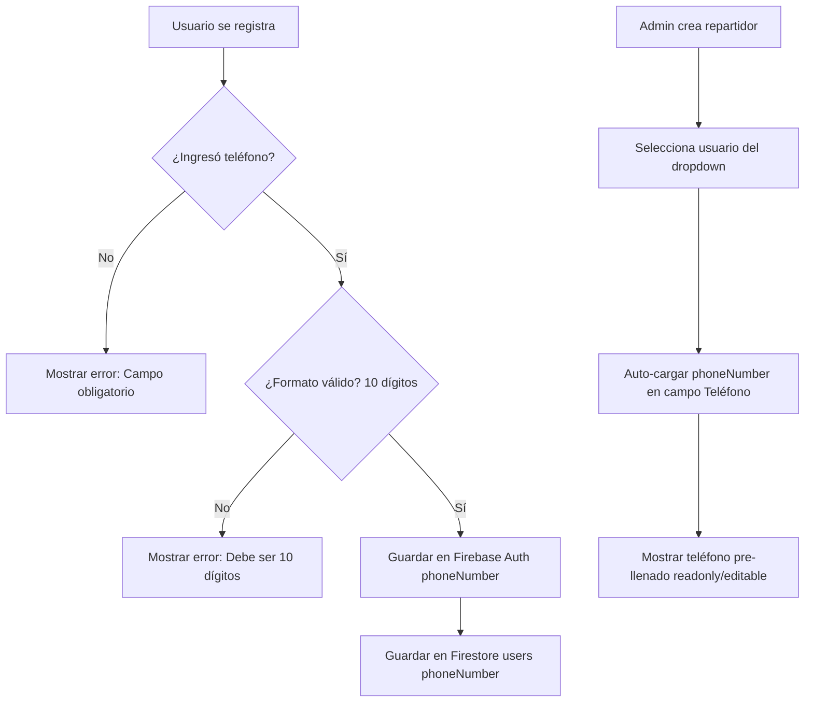
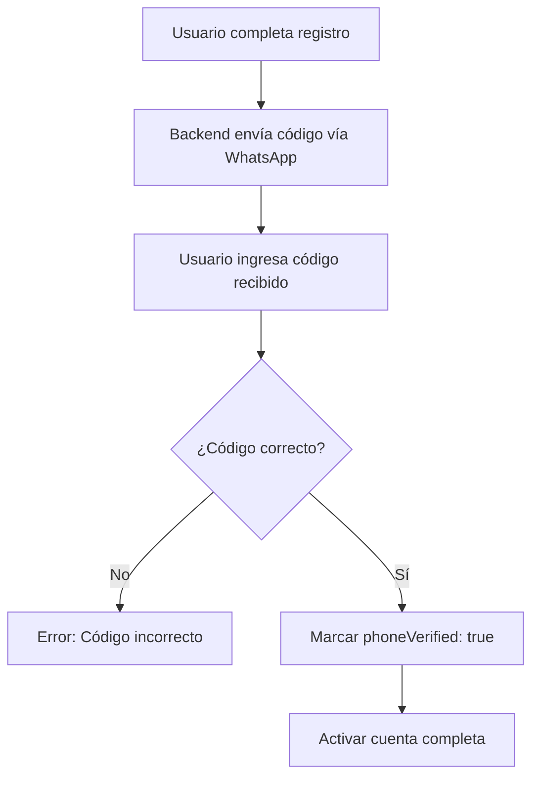

# Próxima Sesión: Implementación de Validación de Teléfono Obligatoria

**Fecha de creación**: 2025-10-25
**Prioridad**: 🟡 MEDIA
**Estado**: 📋 PLANIFICACIÓN
**Tipo**: Nueva Funcionalidad

---

## 🎯 Objetivo Principal

Implementar un sistema de validación de teléfono obligatorio para TODOS los usuarios del sistema, con auto-carga del teléfono en el diálogo de creación de repartidores y preparación para validación vía WhatsApp en Fase 2.

---

## 📋 Contexto

### Situación Actual
- ❌ Campo `phoneNumber` es **opcional** en el registro de usuarios
- ❌ No hay validación de formato (10 dígitos)
- ❌ AddEditDriverDialog requiere ingresar teléfono manualmente
- ❌ No hay verificación de que el teléfono sea válido/activo

### Situación Deseada
- ✅ Campo `phoneNumber` **obligatorio** para TODOS los usuarios nuevos
- ✅ Validación de formato: exactamente 10 dígitos numéricos
- ✅ Auto-carga automática del teléfono en AddEditDriverDialog
- 🔮 **Fase 2**: Verificación vía WhatsApp antes de activar cuenta

---

## 🏗️ Arquitectura de la Solución

### **Fase 1: Validación Obligatoria y Auto-carga** (Esta Sesión)



### **Fase 2: Verificación WhatsApp** (Futura Sesión)



---

## 📝 Tareas a Implementar - Fase 1

### **1. Frontend - Registro de Usuarios**

#### **Archivos a Modificar**
- 📁 `src/app/registro/page.tsx` (o donde esté el formulario de registro)
- 📁 `src/components/auth/RegisterForm.tsx` (si existe)

#### **Cambios Requeridos**

**A. Agregar campo de teléfono obligatorio**
```typescript
const [phoneNumber, setPhoneNumber] = useState('');
const [phoneError, setPhoneError] = useState('');

// Validación
const validatePhone = (phone: string): boolean => {
  // Quitar espacios, guiones, paréntesis
  const cleaned = phone.replace(/\D/g, '');

  if (cleaned.length !== 10) {
    setPhoneError('El teléfono debe tener exactamente 10 dígitos');
    return false;
  }

  setPhoneError('');
  return true;
};

// En el submit
const handleSubmit = async (e: React.FormEvent) => {
  e.preventDefault();

  if (!validatePhone(phoneNumber)) {
    return;
  }

  // Formatear teléfono para Firebase Auth (formato E.164)
  const formattedPhone = `+52${phoneNumber.replace(/\D/g, '')}`;

  // Crear usuario...
};
```

**B. UI del campo teléfono**
```tsx
<div className="space-y-2">
  <Label htmlFor="phone">
    Teléfono <span className="text-red-500">*</span>
  </Label>
  <Input
    id="phone"
    type="tel"
    value={phoneNumber}
    onChange={(e) => {
      setPhoneNumber(e.target.value);
      validatePhone(e.target.value);
    }}
    placeholder="10 dígitos (ej: 9981234567)"
    maxLength={10}
    required
    className={phoneError ? 'border-red-500' : ''}
  />
  {phoneError && (
    <p className="text-sm text-red-500">{phoneError}</p>
  )}
  <p className="text-xs text-gray-400">
    Se usará para comunicación y verificación vía WhatsApp
  </p>
</div>
```

---

### **2. Backend - Validación Server-Side**

#### **Archivos a Modificar**
- 📁 `backend/app.js` - Endpoint de creación de usuarios

#### **Cambios Requeridos**

**A. Endpoint POST /api/auth/register (o similar)**
```javascript
app.post('/api/auth/register', async (req, res) => {
  try {
    const { email, password, displayName, phoneNumber } = req.body;

    // Validación: Teléfono obligatorio
    if (!phoneNumber) {
      return res.status(400).json({
        message: 'El número de teléfono es obligatorio'
      });
    }

    // Validación: Formato de teléfono
    const cleaned = phoneNumber.replace(/\D/g, '');
    if (cleaned.length !== 10) {
      return res.status(400).json({
        message: 'El teléfono debe tener exactamente 10 dígitos'
      });
    }

    // Formatear a E.164 para Firebase Auth
    const formattedPhone = `+52${cleaned}`;

    // Crear usuario en Firebase Auth
    const userRecord = await admin.auth().createUser({
      email,
      password,
      displayName,
      phoneNumber: formattedPhone, // ← OBLIGATORIO
    });

    // Crear documento en Firestore
    await db.collection('users').doc(userRecord.uid).set({
      email,
      displayName,
      phoneNumber: formattedPhone,
      phoneVerified: false, // ← Para Fase 2
      role: 'usuario',
      active: true,
      createdAt: admin.firestore.FieldValue.serverTimestamp(),
      updatedAt: admin.firestore.FieldValue.serverTimestamp(),
      deleted: false,
    });

    res.status(201).json({
      message: 'Usuario creado exitosamente',
      userId: userRecord.uid
    });

  } catch (error) {
    console.error('Error creating user:', error);
    res.status(500).json({ message: 'Error interno del servidor' });
  }
});
```

**B. Endpoint PATCH /api/control/usuarios/:userId**

Agregar validación cuando se actualiza el teléfono:

```javascript
// En PATCH /api/control/usuarios/:userId
if (phoneNumber !== undefined) {
  const cleaned = phoneNumber.replace(/\D/g, '');
  if (cleaned.length !== 10) {
    return res.status(400).json({
      message: 'El teléfono debe tener exactamente 10 dígitos'
    });
  }

  const formattedPhone = `+52${cleaned}`;

  // Actualizar en Firebase Auth
  await admin.auth().updateUser(userId, {
    phoneNumber: formattedPhone,
  });

  // Actualizar en Firestore
  updateData.phoneNumber = formattedPhone;
}
```

---

### **3. AddEditDriverDialog - Auto-carga de Teléfono**

#### **Archivo a Modificar**
- 📁 `src/components/control/AddEditDriverDialog.tsx`

#### **Cambios Requeridos**

**A. Cargar teléfono del usuario seleccionado**

```typescript
// Agregar al useEffect que maneja la selección de usuario
useEffect(() => {
  if (selectedUserId && !isEditing) {
    // Buscar el usuario seleccionado en unlinkedUsers
    const selectedUser = unlinkedUsers.find(u => u.uid === selectedUserId);

    if (selectedUser) {
      // Auto-llenar campos desde el usuario
      setName(selectedUser.displayName || selectedUser.email?.split('@')[0] || '');

      // Auto-llenar teléfono (quitar +52 para mostrarlo limpio)
      if (selectedUser.phoneNumber) {
        const cleanPhone = selectedUser.phoneNumber.replace('+52', '');
        setPhone(cleanPhone);
      }
    }
  }
}, [selectedUserId, unlinkedUsers, isEditing]);
```

**B. Actualizar interfaz UnlinkedRepartidorUser**

```typescript
interface UnlinkedRepartidorUser {
  uid: string;
  email: string;
  displayName: string;
  phoneNumber?: string; // ← Agregar este campo
}
```

**C. Actualizar endpoint GET /api/control/unlinked-repartidor-users**

En `backend/app.js`:

```javascript
app.get('/api/control/unlinked-repartidor-users', authMiddleware, requireAdmin, async (req, res) => {
  try {
    // ... código existente ...

    const unlinkedRepartidorUsers = repartidorAuthUsers.filter(userRecord =>
      !existingRepartidorUserIds.has(userRecord.uid)
    ).map(userRecord => ({
      uid: userRecord.uid,
      email: userRecord.email,
      displayName: userRecord.displayName || userRecord.email,
      phoneNumber: userRecord.phoneNumber || null, // ← Agregar teléfono
    }));

    res.status(200).json(unlinkedRepartidorUsers);

  } catch (error) {
    console.error('Error fetching unlinked repartidor users:', error);
    res.status(500).json({ message: 'Error interno del servidor' });
  }
});
```

**D. Hacer el campo Teléfono readonly o pre-llenado**

Opción 1 - **Readonly** (no editable):
```tsx
<Input
  id="phone"
  value={phone}
  readOnly
  className="bg-gray-700 cursor-not-allowed"
  placeholder="Se cargará del usuario seleccionado"
/>
<p className="text-xs text-gray-400">
  Teléfono obtenido del perfil del usuario
</p>
```

Opción 2 - **Editable** (permite corrección):
```tsx
<Input
  id="phone"
  value={phone}
  onChange={(e) => setPhone(e.target.value)}
  placeholder="Se cargará del usuario seleccionado"
  className="bg-gray-800 border-gray-700"
/>
<p className="text-xs text-gray-400">
  ✓ Teléfono cargado automáticamente (puedes editarlo si es necesario)
</p>
```

---

### **4. Validación en Gestión de Usuarios Existente**

#### **Archivo a Modificar**
- 📁 `src/components/control/edit-user-dialog.tsx` (o similar)

#### **Cambios Requeridos**

Agregar validación de teléfono si el admin intenta modificar un usuario:

```typescript
const [phoneNumber, setPhoneNumber] = useState('');
const [phoneError, setPhoneError] = useState('');

const validatePhone = (phone: string): boolean => {
  if (!phone) {
    setPhoneError('El teléfono es obligatorio');
    return false;
  }

  const cleaned = phone.replace(/\D/g, '');
  if (cleaned.length !== 10) {
    setPhoneError('El teléfono debe tener exactamente 10 dígitos');
    return false;
  }

  setPhoneError('');
  return true;
};
```

---

## 🧪 Testing - Fase 1

### **Tests a Crear/Actualizar**

#### **1. Backend - `backend/usuarios.test.js`**

```javascript
describe('Phone Number Validation', () => {
  it('should reject user creation without phone number', async () => {
    const res = await request(app)
      .post('/api/auth/register')
      .send({
        email: 'test@example.com',
        password: 'password123',
        displayName: 'Test User',
        // phoneNumber faltante
      });

    expect(res.statusCode).toBe(400);
    expect(res.body.message).toContain('teléfono es obligatorio');
  });

  it('should reject phone number with less than 10 digits', async () => {
    const res = await request(app)
      .post('/api/auth/register')
      .send({
        email: 'test@example.com',
        password: 'password123',
        displayName: 'Test User',
        phoneNumber: '123456789', // 9 dígitos
      });

    expect(res.statusCode).toBe(400);
    expect(res.body.message).toContain('10 dígitos');
  });

  it('should accept valid 10-digit phone number', async () => {
    const res = await request(app)
      .post('/api/auth/register')
      .send({
        email: 'test@example.com',
        password: 'password123',
        displayName: 'Test User',
        phoneNumber: '9981234567',
      });

    expect(res.statusCode).toBe(201);
  });

  it('should format phone to E.164 format (+52)', async () => {
    // Mock Firebase Admin
    mockCreateUser.mockResolvedValue({ uid: 'test-uid' });

    const res = await request(app)
      .post('/api/auth/register')
      .send({
        email: 'test@example.com',
        password: 'password123',
        displayName: 'Test User',
        phoneNumber: '9981234567',
      });

    expect(mockCreateUser).toHaveBeenCalledWith(
      expect.objectContaining({
        phoneNumber: '+529981234567',
      })
    );
  });
});

describe('GET /api/control/unlinked-repartidor-users', () => {
  it('should include phoneNumber in response', async () => {
    // Mock data
    mockListUsers.mockResolvedValue({
      users: [{
        uid: 'user-123',
        email: 'repartidor@test.com',
        displayName: 'Repartidor Test',
        phoneNumber: '+529981234567',
        customClaims: { repartidor: true },
      }],
    });

    const res = await request(app)
      .get('/api/control/unlinked-repartidor-users')
      .set('Authorization', 'Bearer test-admin-token');

    expect(res.statusCode).toBe(200);
    expect(res.body[0]).toHaveProperty('phoneNumber', '+529981234567');
  });
});
```

#### **2. Frontend - Componente Tests**

```typescript
// src/components/control/__tests__/AddEditDriverDialog.test.tsx

describe('AddEditDriverDialog - Phone Auto-load', () => {
  it('should auto-fill phone when user is selected', async () => {
    const mockUnlinkedUsers = [
      {
        uid: 'user-123',
        email: 'test@example.com',
        displayName: 'Test User',
        phoneNumber: '+529981234567',
      },
    ];

    // Mock fetch
    global.fetch = jest.fn(() =>
      Promise.resolve({
        ok: true,
        json: async () => mockUnlinkedUsers,
      })
    );

    const { getByRole, getByLabelText } = render(
      <AddEditDriverDialog
        driver={null}
        isOpen={true}
        onOpenChange={jest.fn()}
        onSuccess={jest.fn()}
      />
    );

    // Seleccionar usuario del dropdown
    const select = getByRole('combobox');
    fireEvent.click(select);

    const option = await screen.findByText('Test User');
    fireEvent.click(option);

    // Verificar que el teléfono se auto-llenó
    const phoneInput = getByLabelText('Teléfono');
    expect(phoneInput).toHaveValue('9981234567');
  });

  it('should strip +52 from phone number display', () => {
    const phone = '+529981234567';
    const cleaned = phone.replace('+52', '');
    expect(cleaned).toBe('9981234567');
  });
});
```

---

## 📊 Migración de Usuarios Existentes

### **Problema**
Usuarios existentes pueden NO tener teléfono registrado.

### **Solución**

**Opción A - Forzar actualización en próximo login** ✅ RECOMENDADA
```javascript
// En withAuth.tsx o FirebaseProvider
useEffect(() => {
  if (user && userData) {
    // Si no tiene teléfono, redirigir a completar perfil
    if (!userData.phoneNumber) {
      router.push('/completar-perfil');
    }
  }
}, [user, userData]);
```

**Opción B - Script de migración one-time**
```javascript
// backend/scripts/migrate-add-phone-requirement.js
const admin = require('firebase-admin');
admin.initializeApp();

async function migrateUsers() {
  const usersSnapshot = await admin.firestore().collection('users').get();

  for (const doc of usersSnapshot.docs) {
    const data = doc.data();

    if (!data.phoneNumber) {
      // Marcar como necesita completar perfil
      await doc.ref.update({
        requiresPhoneUpdate: true,
      });

      console.log(`User ${doc.id} needs to update phone`);
    }
  }
}

migrateUsers();
```

**Opción C - Dejar usuarios existentes sin cambios**
- Nuevos usuarios: Teléfono obligatorio
- Usuarios existentes: Opcional (no forzar retroactividad)

---

## 🔮 Fase 2: Verificación WhatsApp (Futura Sesión)

### **Tecnologías a Considerar**

1. **Twilio API** (Opción Recomendada)
   - Servicio robusto y confiable
   - Envío de SMS/WhatsApp
   - ~$0.005 USD por mensaje
   - Documentación: https://www.twilio.com/docs/whatsapp

2. **Firebase Phone Authentication**
   - Integrado con Firebase
   - Solo SMS (no WhatsApp directo)
   - Gratis hasta cierto límite

3. **WhatsApp Business API**
   - Oficial de Meta
   - Más complejo de configurar
   - Requiere aprobación de Meta

### **Flujo Propuesto (Fase 2)**

```javascript
// Backend endpoint
app.post('/api/auth/send-verification-code', async (req, res) => {
  const { phoneNumber, userId } = req.body;

  // Generar código de 6 dígitos
  const code = Math.floor(100000 + Math.random() * 900000).toString();

  // Guardar código en Firestore (expira en 10 minutos)
  await db.collection('verificationCodes').doc(userId).set({
    code,
    phoneNumber,
    expiresAt: admin.firestore.Timestamp.fromDate(
      new Date(Date.now() + 10 * 60 * 1000)
    ),
  });

  // Enviar código vía Twilio WhatsApp
  await twilioClient.messages.create({
    from: 'whatsapp:+14155238886', // Twilio Sandbox
    to: `whatsapp:${phoneNumber}`,
    body: `Tu código de verificación es: ${code}`,
  });

  res.status(200).json({ message: 'Código enviado' });
});

app.post('/api/auth/verify-phone', async (req, res) => {
  const { userId, code } = req.body;

  const verificationDoc = await db.collection('verificationCodes').doc(userId).get();

  if (!verificationDoc.exists) {
    return res.status(404).json({ message: 'Código no encontrado' });
  }

  const data = verificationDoc.data();

  // Verificar expiración
  if (data.expiresAt.toDate() < new Date()) {
    return res.status(400).json({ message: 'Código expirado' });
  }

  // Verificar código
  if (data.code !== code) {
    return res.status(400).json({ message: 'Código incorrecto' });
  }

  // Marcar como verificado
  await db.collection('users').doc(userId).update({
    phoneVerified: true,
  });

  // Eliminar código usado
  await verificationDoc.ref.delete();

  res.status(200).json({ message: 'Teléfono verificado exitosamente' });
});
```

---

## 📁 Archivos que se Modificarán/Crearán

### **Fase 1 - Archivos a Modificar**

#### Backend
- ✏️ `backend/app.js`
  - Endpoint de registro de usuarios (validación teléfono)
  - Endpoint `GET /api/control/unlinked-repartidor-users` (incluir phoneNumber)
  - Endpoint `PATCH /api/control/usuarios/:userId` (validación teléfono)

#### Frontend
- ✏️ `src/app/registro/page.tsx` (agregar campo teléfono obligatorio)
- ✏️ `src/components/control/AddEditDriverDialog.tsx` (auto-carga teléfono)
- ✏️ `src/components/control/edit-user-dialog.tsx` (validación teléfono)

#### Tests
- ✏️ `backend/usuarios.test.js` (tests de validación teléfono)
- 📄 `src/components/control/__tests__/AddEditDriverDialog.test.tsx` (tests auto-carga)

### **Fase 2 - Archivos Nuevos (Futura Sesión)**

- 📄 `backend/twilio-service.js` (servicio de envío WhatsApp)
- 📄 `src/app/verificar-telefono/page.tsx` (página de verificación)
- 📄 `src/components/auth/PhoneVerificationForm.tsx` (formulario verificación)

---

## 🎯 Criterios de Aceptación - Fase 1

### **Funcionales**
- ✅ Usuario NO puede registrarse sin proporcionar teléfono
- ✅ Teléfono debe tener exactamente 10 dígitos numéricos
- ✅ Backend rechaza teléfonos con formato inválido
- ✅ Teléfono se guarda en formato E.164 (`+52XXXXXXXXXX`)
- ✅ AddEditDriverDialog carga automáticamente el teléfono del usuario seleccionado
- ✅ Admin puede ver el teléfono en la gestión de usuarios
- ✅ Endpoint unlinked-repartidor-users incluye phoneNumber en respuesta

### **No Funcionales**
- ✅ Validación client-side con feedback inmediato
- ✅ Validación server-side para seguridad
- ✅ Tests de cobertura al 100%
- ✅ UI intuitiva con mensajes de ayuda
- ✅ Compatible con usuarios existentes (migración o forzar actualización)

---

## 🚧 Consideraciones y Decisiones Pendientes

### **Decisión 1: ¿Qué hacer con usuarios existentes sin teléfono?**

**Opciones**:
- A) Forzar actualización en próximo login → Redirigir a `/completar-perfil`
- B) Dejar opcional para usuarios existentes, obligatorio solo para nuevos
- C) Script de migración masiva (contactar usuarios vía email)

**Recomendación**: Opción A - Forzar actualización

---

### **Decisión 2: ¿El campo teléfono en AddEditDriverDialog debe ser editable?**

**Opciones**:
- A) Readonly - No permite edición (más seguro, evita inconsistencias)
- B) Editable - Permite corrección manual (más flexible)

**Recomendación**: Opción B - Editable (pero pre-llenado)

**Razón**: El admin puede necesitar corregir si el teléfono del usuario está mal

---

### **Decisión 3: ¿Validar que el teléfono sea único?**

**Opciones**:
- A) Sí - Un teléfono solo puede estar asociado a un usuario
- B) No - Permitir duplicados (ej: familia compartida)

**Recomendación**: Opción A - Teléfonos únicos

**Razón**: Necesario para verificación WhatsApp y comunicación individual

---

## 📊 Estimación de Esfuerzo

| Tarea | Complejidad | Tiempo Estimado |
|-------|-------------|-----------------|
| Validación frontend registro | 🟢 Baja | 30 min |
| Validación backend registro | 🟢 Baja | 30 min |
| Auto-carga en AddEditDriverDialog | 🟡 Media | 45 min |
| Actualizar endpoint unlinked-users | 🟢 Baja | 15 min |
| Tests backend | 🟡 Media | 1 hora |
| Tests frontend | 🟡 Media | 45 min |
| Migración usuarios existentes | 🟡 Media | 30 min |
| Documentación | 🟢 Baja | 20 min |

**Total estimado**: ~4-5 horas

---

## 🚀 Plan de Implementación Sugerido

### **Orden de Ejecución**

1. **Backend primero** (foundational)
   - Validación en endpoint de registro
   - Actualizar endpoint unlinked-repartidor-users
   - Tests backend

2. **Frontend registro** (user-facing)
   - Agregar campo teléfono obligatorio
   - Validación client-side
   - Tests frontend

3. **AddEditDriverDialog** (feature)
   - Auto-carga de teléfono
   - Tests de integración

4. **Migración** (data)
   - Decidir estrategia para usuarios existentes
   - Implementar solución elegida

5. **Documentación** (final)
   - Actualizar docs de API
   - Guía de usuario para admins

---

## 📚 Referencias

### **Documentación Externa**
- Firebase Auth Phone: https://firebase.google.com/docs/auth/web/phone-auth
- Twilio WhatsApp API: https://www.twilio.com/docs/whatsapp/quickstart
- E.164 Format: https://en.wikipedia.org/wiki/E.164

### **Documentación Interna**
- `docs/02-architecture/blueprint.md` - Arquitectura del sistema
- `docs/06-development/session-2025-10-25-driver-dashboard-improvements.md` - Sesión anterior
- `backend/app.js:4599` - Endpoint PATCH usuarios (referencia)
- `src/components/control/AddEditDriverDialog.tsx` - Componente a modificar

---

## ✅ Checklist Pre-Implementación

Antes de empezar la implementación, verificar:

- [ ] Backend corriendo sin errores
- [ ] Frontend corriendo sin errores
- [ ] Tests pasando al 100% (baseline)
- [ ] Git status limpio (commit previo)
- [ ] Firestore reglas revisadas (permitir phoneNumber)
- [ ] Decisiones tomadas sobre:
  - [ ] Usuarios existentes sin teléfono
  - [ ] Campo editable vs readonly
  - [ ] Validación de teléfonos únicos

---

## 🎯 Resultado Esperado - Fase 1

Al finalizar esta sesión:

✅ **Usuario nuevo**:
```
1. Intenta registrarse sin teléfono → Error: "Campo obligatorio"
2. Ingresa teléfono con 9 dígitos → Error: "Debe ser 10 dígitos"
3. Ingresa teléfono válido (9981234567) → ✅ Registro exitoso
4. Teléfono guardado como +529981234567 en Firebase
```

✅ **Admin crea repartidor**:
```
1. Va a /control/repartidores
2. Click "Añadir Repartidor"
3. Selecciona usuario del dropdown
4. ✅ Campo "Teléfono" se auto-llena con "9981234567"
5. Admin puede editar si es necesario
6. Click "Crear Repartidor"
7. ✅ Repartidor creado con teléfono correcto
```

✅ **Repartidor accede a dashboard**:
```
1. Login como repartidor
2. ✅ Dashboard funciona correctamente
3. Datos de contacto incluyen teléfono
```

---

## 📝 Notas Adicionales

### **Formato de Teléfono**
- **Storage**: `+52XXXXXXXXXX` (formato E.164 en Firebase)
- **Display**: `XXXXXXXXXX` (10 dígitos en UI)
- **Input**: Acepta solo números, auto-limpia espacios/guiones

### **Mensajes de Error Sugeridos**
```javascript
const ERROR_MESSAGES = {
  PHONE_REQUIRED: 'El número de teléfono es obligatorio',
  PHONE_INVALID_LENGTH: 'El teléfono debe tener exactamente 10 dígitos',
  PHONE_INVALID_FORMAT: 'El teléfono debe contener solo números',
  PHONE_DUPLICATE: 'Este número de teléfono ya está registrado',
};
```

### **Regex de Validación**
```javascript
// Solo números, exactamente 10 dígitos
const PHONE_REGEX = /^\d{10}$/;

// Limpieza (quitar todo excepto dígitos)
const cleanPhone = (phone) => phone.replace(/\D/g, '');

// Validación completa
const isValidPhone = (phone) => {
  const cleaned = cleanPhone(phone);
  return PHONE_REGEX.test(cleaned);
};
```

---

**Última actualización**: 2025-10-25
**Versión**: 1.0
**Próximo paso**: Esperar confirmación del usuario para ejecutar `/clear` e iniciar implementación
